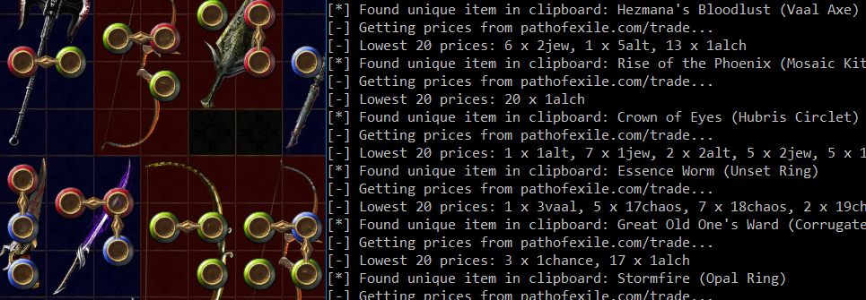

# Path of Exile sample Python 3 tools

## What

Small (easily-readable) sample scripts which:
- can assign macros to shortcuts (e.g. *F3* -> *go to hideout*)
- interact with the [pathofexile.com/trade]() (internal?) API

The code is brief to allow for easy reading / extending / altering.

## Why

Very few code samples out there that are short enough to skim through and/or that interact with
the game ecosystem from other languages than *AutoIt*.

**Note**: To be treated as code samples, not published tools!

## Dependencies

*Python 3* and the wonderful `keyboard` and `requests` modules (run `install_deps.bat` or simply
`pip3 install -r requirements.txt`).

## Running

Either run one of the `poe_*` scripts or run `run.py` to have all (both) running at the same time.
Note that these are command line scripts without GUIs, so in case nothing happens when you run
one of them, try running the script from a command line (`cmd.exe`) to see the (usually explicit)
errors it produces.

## Scripts

### poe_macros.py

Allows binding writing text to the current active window to keyboard shortcuts. To use, rename
`macros.txt.sample` to `macros.txt` and add entries to it. Each entry must be a shortcut followed
by a pipe (`|`) and the text to send. Special keys are wrapped in curly braces, e.g.
`{cr}hello!{cr}` will send an *Enter*, write "hello!", and send another *Enter* to the active
window.

`macros.txt` sample:

~~~
# this is a comment
F4|{ctrl+enter}thanks!{cr}{cr}/kick your_player_name{cr}
F3|{cr}/hideout{cr}
~~~

**WARNING:** *No check is made as to which is the active window (can test the script by pressing
the shortcuts in Notepad), the text is simply sent to whichever program has input focus.* On the
bright side, this makes the script easily retrofitted into a generic macro tool for all programs.

### poe_watchclip.py

Watches the clipboard for a unique item's info being copied (by pressing *Ctrl+C* while hovering
an item in-game - this is a standard game feature!) and queries [pathofexile.com/trade]() for the
lowest 20 prices for which that item is listed (useful to get an idea if that random unique is
now worth $$$ exalts).

*Update*: added support for retrieving currency rates as well (if you *Ctrl+C* over e.g. an *Exalted
Orb* you get a list of what it's selling for). The `currency-map.txt` file contains name mappings
from the full / in-game name to the random-like shortcuts used by the site ("Perandus Coin" is
"p"?!), but it's only partially filled in.

**Note:** I am not sure whether the trade API (not the site, but the actual internal API used by
the site) is intended to be used in tools. If not, please let me know & I'll remove the offending
code.

### poe_clienttxt.py

Finds the location of the game log (client.txt) from the main window's handle (see the script's
docstring for details) and watches it for area changes.

### poe_overlay.py

Shows an overlay on top of all windows (including the game's window if it's configured to be in one
of "Windowed" or "Windowed full screen" modes). The overlay simply displays if the game is running
or not (i.e. if a window called "Path of Exile" exists).

## Feedback

Feedback is welcome either via email or on the issues page.

Vlad Ioan Topan, dec. 2018

